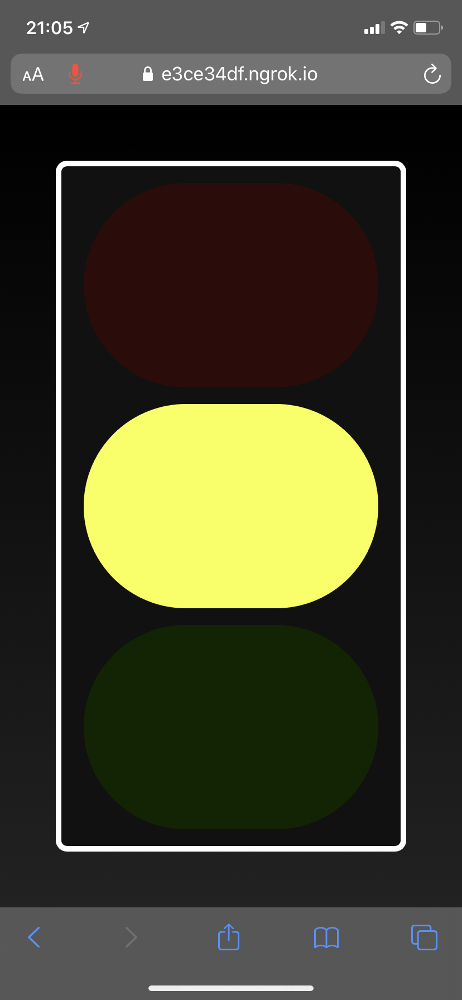

# Noise Traffic Light

This tiny web app measures the ambient noise level using the [Web Audio API](https://developer.mozilla.org/en-US/docs/Web/API/Web_Audio_API) and visualizes it using traffic light colors. 
No rocket science involved, but it still took me a while to find out how to use Web Audio.
Therefore I hope this will one time help somebody else to get going quickly.

## Running locally

You may need to use `ngrok` in some occasions (e.g. Safari on iOS) to be able to serve the website over HTTPS.
Safari on iOS does not allow access to the microphone on insecure connections.
